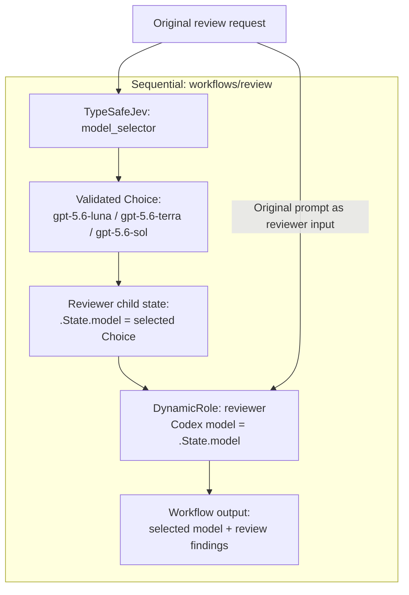
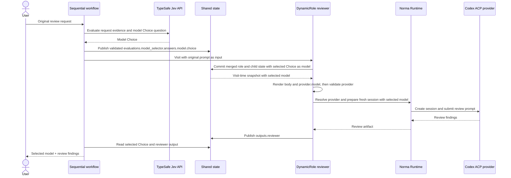

# TypeSafe Jev + DynamicRole model-selector pack

This self-contained pack asks TypeSafe Jev to select a Codex model before a
`DynamicRole` starts:

- `codex/jev-model-selector/evaluations/model-selector` returns a validated
  Choice of `gpt-5.6-luna`, `gpt-5.6-terra`, or `gpt-5.6-sol`.
- `codex/jev-model-selector/roles/dynamic-reviewer` renders its provider model
  from visit-time state.
- `codex/jev-model-selector/workflows/review` runs both nodes in a `Sequential`
  and passes the typed Choice through child state.

The workflow reads the selected value from
`.State.evaluations.model_selector.answers.model.choice`. The DynamicRole has a
default model so it also validates and runs independently; the workflow's child
state replaces that default before provider rendering.

## Workflow diagrams

The Sequential workflow selects a model first, then reviews the original
request with that model:



The selected Choice is published in the root run's shared state. The reviewer
child state overrides the role's default model before the provider is rendered
and validated. Each reviewer visit then creates a fresh Codex session through
Norma Runtime:



## Validate and inspect the pack

From the repository root:

```bash
callee agent validate examples/codex/jev-model-selector/evaluations/model-selector.md
callee agent validate examples/codex/jev-model-selector/roles/dynamic-reviewer.md
callee agent validate examples/codex/jev-model-selector/workflows/review.md
callee --agent-root examples agent view codex/jev-model-selector/workflows/review
```

## Import the pack

Import every resource into the same namespace:

```bash
callee agent import baldaworks/callee \
  --path examples/codex/jev-model-selector \
  --prefix codex/jev-model-selector
```

Then inspect and run the workflow:

```bash
callee agent view codex/jev-model-selector/workflows/review
callee agent run codex/jev-model-selector/workflows/review \
  --message "Review the authentication changes in this repository"
```

Running the pack requires `TYPESAFE_API_KEY`, an installed and authenticated
Codex CLI, and a controlling terminal for the reviewer's `ask` permission mode.
Model availability depends on the installed Codex provider.
